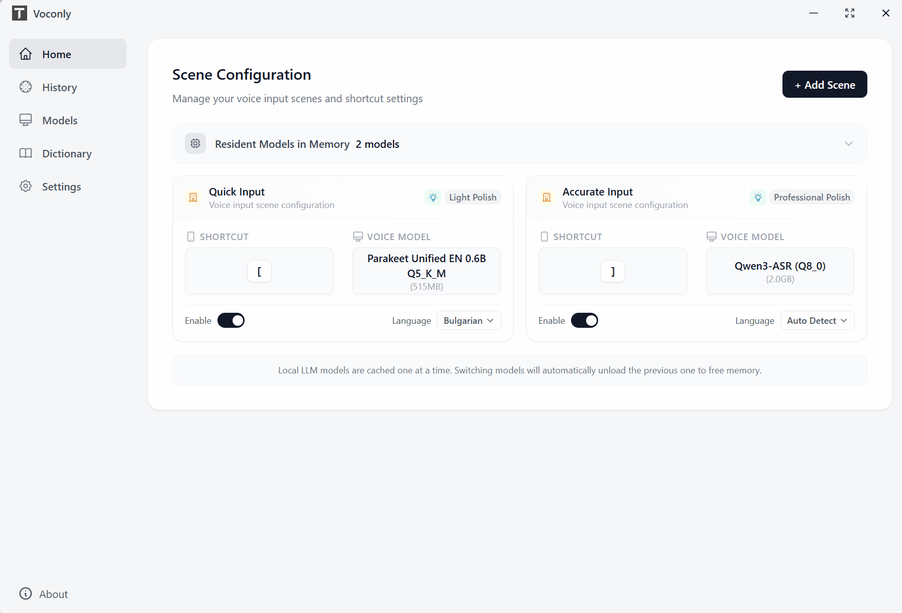

# Voconly - Local AI Voice Input Assistant

Voconly is a free, opensource, local-first AI voice input assistant (voice-to-text tool). Speak, let AI organize it into text. Your voice data stays local, works offline. Supports Whisper, SenseVoice, Parakeet ,Qwen-asr speech recognition models, with LLM post-processing for polishing, translation, meeting notes. Perfect for content creation, email drafting, meeting records, quick note-taking.



[Download Now](https://github.com/xinkyle/Voconly/releases) | [Website](https://www.voconly.com) | [Use Cases](#use-cases) | [Contributing](#contributing)

---

## Core Features

### Scenario-based Configuration

Configure dedicated combinations for different use cases:

- Custom scenario names
- Bind hotkeys for one-click recording
- Choose ASR models (Whisper / SenseVoice / Parakeet / Qwen-Asr)
- Optional LLM post-processing (light polish, translation, professional polish, meeting secretary, custom prompts supported)

### Real-time Transcription

See text as you speak, with results ready the moment you finish. Automatic optimization for streaming and non-streaming models.

### Local ASR, Privacy-first

- Local speech recognition engine, data never leaves your device
- Supports multiple models: Whisper, SenseVoice, Parakeet, Qwen-Asr
- Zero network latency, always available

### Flexible LLM Support

- Local models: Run via Llama.cpp
- Cloud APIs: Support for multiple providers
- Built-in processing modes: light polish, translation, professional polish, meeting secretary
- Custom presets: Configure processing logic as needed

### Quick Trigger

Global hotkey activation. One keystroke completes: recording → transcription → LLM processing → output to cursor position. Double-press the hotkey to skip LLM processing for added flexibility.

---

## LLM Processing Modes

| Mode | Description |
|------|-------------|
| Light Polish | Fix typos and punctuation, preserve original meaning |
| Translation | Chinese→English, cross-language expression |
| Professional Polish | Convert spoken to written style, formal expression |
| Meeting Secretary | Summarize meeting key points, structured output |
| Custom Preset | Configure processing logic as needed |

---

## Use Cases

| Scenario | Typical Uses |
|----------|--------------|
| Content Creation | Article ideas, video scripts, creative thoughts |
| Workplace | Email drafting, work summaries, meeting notes |
| Developers | Requirement descriptions, technical ideas, issue writing |
| Daily Records | Inspiration notes, learning insights, life logging |

---

## Installation

### Download

Go to the [Releases](https://github.com/xinkyle/Voconly/releases) page to download the latest version.

### Requirements

- Windows 10/11
- GPU recommended for better performance

### Build from Source

```powershell
# 1. Setup environment (check and install dependencies)
.\setup.ps1

# 2. Start development server
.\start-dev.ps1
```

> **Tip**: If you don't have a GPU or don't want to install Vulkan SDK, use `.\setup.ps1 -SkipVulkan`

---

## Roadmap

Completed:
- Local speech recognition (Whisper / SenseVoice / Parakeet / Qwen-Asr)
- LLM post-processing (light polish, translation, professional polish, meeting secretary, custom)
- Scenario-based configuration (hotkey + model + LLM)
- Desktop application (Windows)

Planned:
- macOS / Linux support
- More features welcome your feedback.

If you have ideas, feel free to submit an [Issue](https://github.com/xinkyle/Voconly/issues).

---

## Why Open Source?

The biggest opportunity in the AI era isn't just having AI tools, but enabling everyone to use AI to create their own tools.

Voconly is the beginning of this exploration. I hope to validate: what one person + AI can create.

As a daily voice transcription tool, I really dislike being limited by free usage quotas. I believe many people share this concern, so I open-sourced this project to let everyone use it locally without restrictions.

If this helps you, a Star would be appreciated.

---

## Contributing

Bug reports, suggestions, and code improvements are welcome. Let's explore new ways of productivity in the AI era together.

---

## License

MIT License

Copyright (c) 2026 Xing Yong

---

## About the Author

**Xing Yong (Laoxing.AI)**

15 years of entrepreneurship, long-term focus on AI, big data, and personal creativity. Currently exploring how individuals can regain creative abilities in the AI era.

Started exploring AI in depth in 2024, from not knowing how to use AI for programming to completing products independently with AI. Gradually discovered: AI's greatest value is not replacing programmers, but enabling more ordinary people to regain creative abilities.

Follow me on WeChat Official Account, Xiaohongshu, and other platforms: **老幸.AI**

- Email: laoxingai@139.com

---

## Tech Stack

- Desktop Framework: Tauri 2.0
- Frontend: React + TypeScript
- Speech Recognition: Whisper.cpp (local)
- AI Processing: Local LLM + Cloud API
- Language: Rust + TypeScript
