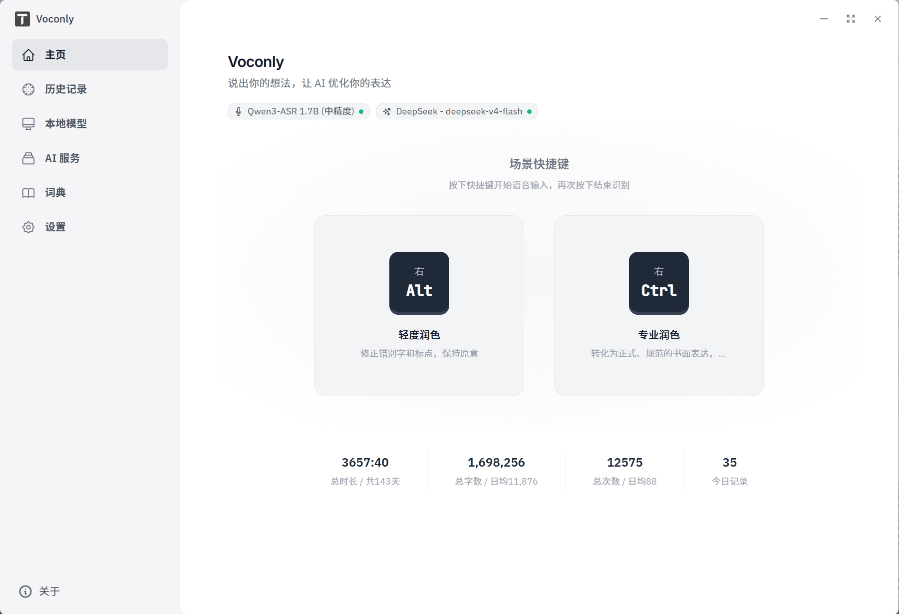

# Voconly - 本地 AI 语音输入助手

**Voconly 是一款免费、开源、本地优先的 AI 语音输入助手，完全运行在你的设备上。**  
> 它将语音在本地转换为文字，并通过 AI 进行润色、翻译、整理和结构化处理，让你在任何应用中用说话代替键盘输入。无需上传音频，不依赖云端服务，保护你的隐私。
> 支持 Whisper、SenseVoice、Parakeet、Qwen-Asr 等语音识别模型。适用于内容创作、邮件撰写、会议记录、灵感速记等场景。



[立即下载](https://github.com/xinkyle/Voconly/releases) | [官网](https://www.voconly.com) | [使用场景](#使用场景) | [参与贡献](#参与贡献)

---

## 核心特点

### 场景化配置

为不同使用场景配置专属组合：
- 自定义场景名称，绑定快捷键一键触发
- 选择 ASR 模型（Whisper / SenseVoice / Parakeet / Qwen-Asr）
- 可选 LLM 后处理（润色、翻译、会议秘书、自定义提示词）

### 实时转写

边说边显示文字，说完即出结果。支持流式和非流式模型自动优化体验。

### 本地 ASR，隐私安全

- 语音数据不上传，对话内容仅你可见
- 零网络延迟，断网也能用
- 支持 Whisper、SenseVoice、Parakeet、Qwen-Asr 等模型

### 灵活的 LLM 支持

- 本地模型：通过 Ollama 运行
- 云端 API：支持多种 Provider
- 内置处理模式：轻度润色、翻译、专业润色、会议秘书

### 快速触发

全局热键唤起，一次按键完成：录音 → 转写 → LLM 处理 → 输出到光标位置（双击快捷键可以跳过LLM，增强灵活性）

---

## LLM 处理模式

| 模式 | 说明 |
|------|------|
| 轻度润色 | 修正错字、标点，保持原意 |
| 翻译 | 中文→英文，跨语言表达 |
| 专业润色 | 口语转书面，正式表达 |
| 会议秘书 | 整理会议要点，结构化输出 |
| 自定义预设 | 按需配置处理逻辑 |

---

## 使用场景

| 场景 | 典型用途 |
|------|----------|
| 内容创作 | 文章灵感、视频脚本、创作想法 |
| 职场工作 | 邮件撰写、工作总结、会议记录 |
| 开发者 | 需求描述、技术想法、Issue 编写 |
| 日常记录 | 灵感笔记、学习心得、生活记录 |

---

## 安装使用

### 下载

前往 [Releases](https://github.com/xinkyle/Voconly/releases) 页面下载最新版本。

### 环境要求

- Windows 10/11
- 推荐具备 GPU 以获得更好性能

### 从源码构建

```powershell
# 1. 一键配置环境（检查并安装依赖）
.\setup.ps1

# 2. 启动开发服务器
.\start-dev.ps1
```

> **提示**：如果没有 GPU 或不想安装 Vulkan SDK，使用 `.\setup.ps1 -SkipVulkan`

---

## Roadmap

已完成：
- 本地语音识别（Whisper / SenseVoice / Parakeet / Qwen-Asr）
- LLM 后处理（轻度润色、翻译、专业润色、会议秘书、自定义）
- 场景化配置（快捷键 + 模型 + LLM）
- 桌面端应用（Windows）

计划中：
- macOS / Linux 支持
- 更多功能，欢迎反馈

如果你有想法，欢迎提交 [Issue](https://github.com/xinkyle/Voconly/issues)。

---

## 为什么开源？

AI 时代最大的机会，不只是拥有 AI 工具，而是每个人都能够利用 AI 创造属于自己的工具。

Voconly 是这个探索的开始。我希望验证：一个人 + AI，能创造什么。

作为每天都要使用的语音转录工具，我很不喜欢被免费额度限制的感觉。相信很多人有同样的顾虑，因此我开源了这个项目，让大家可以在本地无限制使用。

如果对你有帮助，欢迎 Star 支持。

---

## 参与贡献

欢迎提交 Bug、提出建议、优化代码。一起探索 AI 时代新的生产方式。

---

## License

MIT License

Copyright (c) 2026 幸勇

---

## 关于作者

**幸勇（老幸.AI）**

15 年创业经历，长期关注 AI、大数据和个人创造力。正在探索 AI 时代，一个人如何重新获得创造能力。

2024 年开始深入探索 AI，从不会使用 AI 编程，到通过 AI 独立完成产品。逐渐发现：AI 最大的价值，不是替代程序员，而是让更多普通人重新拥有创造能力。

更多故事：欢迎关注公众号、小红书等平台，账号：**老幸.AI**
- Email: laoxingai@139.com

---

## 技术栈

- Desktop Framework: Tauri 2.0
- Frontend: React + TypeScript
- Speech Recognition: Whisper.cpp（本地）
- AI Processing: 本地 LLM + 云端 API
- Language: Rust + TypeScript
