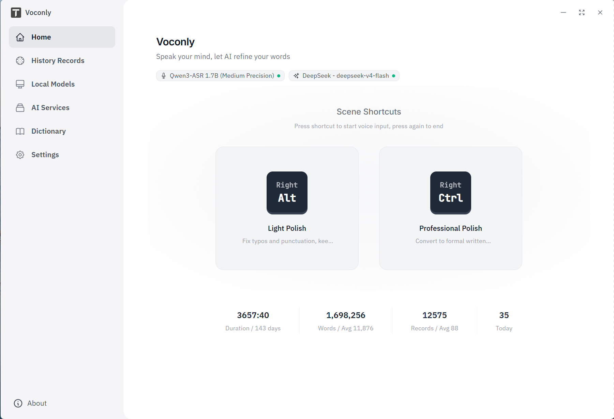

# Voconly — Voice in. Text out. Done.

**Speak naturally. Voconly transcribes locally, refines with AI, and puts finished text right at your cursor — in any app.**

No cloud. No quota. No copy-paste.



[Download](https://github.com/xinkyle/Voconly/releases) · [Website](https://www.voconly.com) · [中文文档](README_CN.md)

---

## Your Thoughts Move Faster Than Your Fingers

Speaking is natural. Typing is slow. Most ideas die in the gap between them.

Voconly closes that gap — speak freely, and let AI handle the cleanup.

---

## Most Voice Tools Stop at Transcription. Voconly Doesn't.

Traditional voice tools turn speech into a transcript — then you copy, paste, and edit.

Voconly turns speech into **finished writing**.

 **Speak naturally**
↓
 **Local transcription**
↓
 **AI understands and refines**
↓
 **Finished text appears at your cursor**

No switching windows. No copy-paste. It lands exactly where you're typing.

**Two ways to finish, one key:**

- **Press to start → press again to stop:** full pipeline, AI-polished output
- **Press to start → double-press to stop:** raw transcript, straight out — skip AI entirely

---

## One Voice. Different Intentions.

The same voice can mean different things — a quick thought, a professional email, a translation, a meeting summary. 

Assign each workflow its own hotkey and switch modes with a single keystroke.

| Mode | You say... | You get... |
|---|---|---|
| 📝 Light Polish | "I mean, I think this plan is actually pretty good, you know, it's just that the timeline is kind of a little too long, and maybe we could, like, make some adjustments and try to shorten it a bit." | "I think this plan is actually pretty good, it's just that the timeline is a little too long, and maybe we could make some adjustments and try to shorten it a bit." |
| 💼 Professional Polish | "I mean, I think this plan is actually pretty good, you know, it's just that the timeline is kind of a little too long, and maybe we could, like, make some adjustments and try to shorten it a bit." | "I think this plan is solid overall, but the current timeline is a bit too long. We could make some adjustments to shorten it.
" |
| 🌐 Translate | "I think the plan is pretty good overall, but the timeline is a bit too long. Maybe we could optimize it a little further." | "嗯，我觉得这个方案整体其实还不错，就是这个时间周期吧，感觉还是有点长，我们是不是可以再优化一下？" |
| 🗂️ Meeting Secretary | Meeting discussion | Structured summary with key points |
| 🛠️ Custom | Anything | Your own prompt, your own logic |

Each mode has its own **hotkey and processing prompt**, while your ASR model and LLM provider work across all modes.

> Press the assigned key to start speaking, then press it again to finish.

---

## Built for Everyday Use

**⚡ See your words as you speak**
No matter which ASR model you use, Voconly gives you a live transcription experience. Text appears while you speak — and it's ready the moment you stop. No spinner. No waiting.

**♾️ Dictate for hours, stay in the flow**
Speak for minutes or hours with a transcription experience built for long sessions.

**📍 Works everywhere you can type**
Browsers, Word, Notion, VS Code, WeChat, your email client — if you can type there, Voconly works there.

---

## Why Voconly?

|  | Voconly | Traditional dictation workflow |
|---|---|---|
|  Privacy | Audio never leaves your device | Often uploaded to the cloud |
|  Limits | Unlimited. No quotas. | Free quotas or subscriptions |
|  Output | Finished, polished text | Raw transcript |
|  Workflow | Appears at your cursor | Copy → paste → edit |
|  Long sessions | Stable for hours | Accuracy may degrade over time |
|  Models | Choose the ones you prefer | Locked into one provider |

---

## Use the Models You Prefer

You're not locked into a single AI stack. Choose between fully local workflows or connect your preferred cloud models.

- **ASR:** Whisper · SenseVoice · Parakeet · Qwen-ASR
- **LLM:** Ollama (local) + major cloud API providers

---

## Get Started in 60 Seconds

1. **Download** Voconly → [Releases](https://github.com/xinkyle/Voconly/releases)
2. **Launch** it — pick a recommended model
3. **Press hotkey and start talking** — press again for polished text, double-press for raw transcript

That's it.

**Build from source (Windows):**

```powershell
.\setup.ps1        # check & install dependencies
.\start-dev.ps1    # start dev server
No GPU / no Vulkan SDK? Use .\setup.ps1 -SkipVulkan (CPU mode). GPU recommended for best speed.
```

Platforms
| Platform | Status |
|----------|--------|
| Windows 10 / 11 | ✅ Available |
| macOS | 🚧 Coming soon |
| Linux | — Not planned |

## Roadmap

### Done

-   Local ASR: Whisper / SenseVoice / Parakeet / Qwen-ASR
    
-   Real-time transcription for every model
    
-   Long-session transcription without drift
    
-   LLM post-processing: quick note / professional / translation / meeting / custom
    
-   Single-key hotkey modes with optional AI pass
    
-   Windows app
    

### Coming soon

-   macOS
    

### Why Open Source?

I built Voconly because I wanted a voice tool that felt truly mine:

-   No subscription quotas
    
-   No audio uploaded by default
    
-   No dependency on a single company
    
-   No black box I couldn't control
    

So I open-sourced it.

Voconly is also my experiment in what one person + AI can build today. If it helps you, a ⭐ means a lot.

### Contributing

Issues, ideas, and PRs welcome — let's explore productivity in the AI era, together.

### License

MIT License — Copyright (c) 2026 Xing Yong

### About

Built by Xing Yong (老幸.AI) — exploring a simple question:  
What can one person build with AI today?  
Voconly is one of those experiments.  
📧 laoxingai@139.com

### Tech Stack

Tauri 2.0 · React + TypeScript · Rust · Whisper.cpp